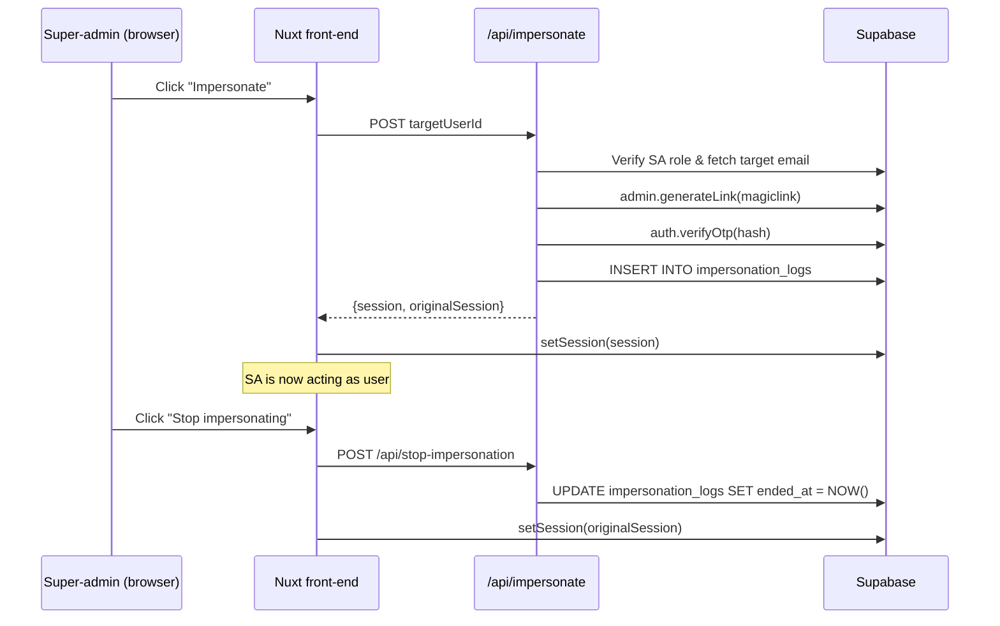

# Impersonation Architecture & Workflow

This document provides a comprehensive overview of how **user impersonation** is implemented in the KwikRate Nuxt 3 code-base. It is intended for developers who will maintain or extend this feature.

---

## 1. What is "Impersonation"?

A **super-admin** can temporarily act "as" another user (the _impersonated user_) in order to debug issues or provide direct support. While impersonating, every request is authenticated with the target user's credentials, yet the system remembers who the real super-admin is and logs the entire session.

## 2. High-level Flow

1. Super-admin selects a user to impersonate in the UI.
2. Front-end calls `POST /api/impersonate` with the target user's UUID.
3. The server-side endpoint verifies super-admin privileges, logs the action, and creates **a new Supabase session** for the target user by generating & verifying a _magic-link_ OTP.
4. The endpoint returns **two** sessions:
   • `session` – the newly created session for the impersonated user.
   • `originalSession` – the super-admin's own session (used for later restoration).
5. Front-end stores both sessions in the Pinia `impersonation` store and swaps the Supabase client to use the impersonated session.
6. When finished, the UI calls `POST /api/stop-impersonation` which finalises the log entry and the front-end restores the original session.

A sequence diagram is shown below:



---

## 3. Server-side Components

### 3.1 REST Endpoints (~/server/api)

| File                         | Purpose                                                           |
| ---------------------------- | ----------------------------------------------------------------- |
| `impersonate.post.ts`        | Main entry-point; creates log entry & new session                 |
| `stop-impersonation.post.ts` | Marks the log as finished                                         |
| `users.post.ts`              | Helper for listing user e-mails that super-admins can impersonate |

### 3.2 Key Implementation Details

`impersonate.post.ts` highlights:

- Uses `assertSuperAdmin(event)` (from `server/utils/auth.ts`) to ensure caller is a super-admin.
- Looks up the **target user's e-mail** by trying, in order:
  1. `supabase.auth.admin.getUserById` (fast & direct).
  2. RPC `get_emails_direct` (JSON-B helper).
  3. RPC `get_user_email_by_id` (SECURITY DEFINER).
- Generates a _magic-link_ via `supabase.auth.admin.generateLink` then immediately verifies it with `auth.verifyOtp` – producing a valid `session` object for the target user **without sending an e-mail**.
- Saves the super-admin's current session (`originalSession`) so that the front-end can restore it later.
- Inserts a row into `impersonation_logs` capturing `super_admin_id`, `impersonated_user_id`, `reason`, and `started_at`.

`stop-impersonation.post.ts`:

- Accepts either the super-admin or impersonated user's ID.
- Updates all open log rows (`ended_at IS NULL`) setting `ended_at = NOW()`. Safety checks ensure we never leak data if IDs are missing.

## 4. Database Layer (Supabase / Postgres)

### 4.1 Schema

```sql
CREATE TABLE public.impersonation_logs (
  id uuid PRIMARY KEY DEFAULT gen_random_uuid(),
  super_admin_id      uuid NOT NULL REFERENCES public.users(id),
  impersonated_user_id uuid NOT NULL REFERENCES public.users(id),
  started_at          timestamptz NOT NULL DEFAULT now(),
  ended_at            timestamptz,
  reason              text,
  created_at          timestamptz NOT NULL DEFAULT now()
);
```

### 4.2 Row-Level Security (RLS)

```
ALTER TABLE public.impersonation_logs ENABLE ROW LEVEL SECURITY;
-- Only super-admins may select / insert / update
CREATE POLICY "Super admins can view all logs"   ON public.impersonation_logs FOR SELECT USING (EXISTS (SELECT 1 FROM public.users WHERE id = auth.uid() AND is_super_admin));
CREATE POLICY "Super admins can create logs"    ON public.impersonation_logs FOR INSERT WITH CHECK (EXISTS (SELECT 1 FROM public.users WHERE id = auth.uid() AND is_super_admin));
CREATE POLICY "Super admins can update their own logs" ON public.impersonation_logs FOR UPDATE USING (super_admin_id = auth.uid());
```

### 4.3 Helper Functions (RPC)

| Function                     | Purpose                                        | Security                                                            |
| ---------------------------- | ---------------------------------------------- | ------------------------------------------------------------------- |
| `get_user_email_by_id(uuid)` | Returns e-mail for a single user; fastest path | `SECURITY DEFINER` – internal check ensures caller `is_super_admin` |
| `get_user_emails()`          | Bulk e-mail list (rarely used)                 | Same guard                                                          |
| `get_emails_direct()`        | JSON-B fallback, kept mainly for legacy        | Same guard                                                          |

These functions are declared with `SECURITY DEFINER` so they execute with the privileges of the function owner (the service role) while still double-checking that the calling `auth.uid()` is a super-admin.

---

## 5. Front-end (Nuxt 3)

### 5.1 Pinia Store – `~/app/stores/impersonation.ts`

- Holds:
  - `originalSession` (serialisable subset)
  - `impersonatedUser`
  - `isImpersonating` flag
- `startImpersonation(session, impersonatedUser, originalSession)` – persists all relevant data to **localStorage** & **sessionStorage** for resilience across reloads.
- `endImpersonation()` – clears the flag and attempts to restore the original session, also calling the `/api/stop-impersonation` endpoint (this is typically wired up in the component that triggers "stop").

### 5.2 Client Plugin – `~/app/plugins/impersonation.client.ts`

Runs very early (`enforce: 'pre'`) to re-hydrate the store on full-page reloads, copying critical data from localStorage into sessionStorage so that other parts of the app (and the Supabase client) can instantly pick up the correct context.

### 5.3 Middleware

`~/app/middleware/handle-impersonation.global.ts` is now a **no-op** since the plugin above performs the restoration work before route navigation occurs.

---

## 6. Security Considerations & Best-practices

1. **Super-admin only**: All privileged paths invoke `assertSuperAdmin`.
2. **Complete audit trail**: Every impersonation session is logged from start to finish.
3. **RLS hard-gates**: Even if a token is leaked, non-super-admin roles cannot read or insert into the log table.
4. **Magic-link verification** avoids needing the user's password.
5. **Session isolation**: Original session is never overwritten – we explicitly restore it.
6. **Token storage**: Access/refresh tokens are stored only in memory or sessionStorage (never persisted long-term).

---

## 7. Extending or Debugging

- The easiest place to hook additional logic (e.g., analytics) is in `/server/api/impersonate.post.ts` **after** the log entry is created.
- If you need the full list of impersonation sessions, query `public.impersonation_logs` (remember to use the service role or be signed-in as super-admin).
- When adding new Supabase policies, double-check that they do not inadvertently grant the impersonated user access to data outside their company scope.

---

## 8. Quick Reference

| Task                 | Where to look                                               |
| -------------------- | ----------------------------------------------------------- |
| Start impersonation  | `POST /api/impersonate`                                     |
| Stop impersonation   | `POST /api/stop-impersonation`                              |
| Log schema & RLS     | `supabase/schemas/complete_schema.sql` + earlier migrations |
| Front-end state      | `~/app/stores/impersonation.ts`                             |
| Client bootstrapping | `~/app/plugins/impersonation.client.ts`                     |

---

_Last updated: 2025-06-11_
