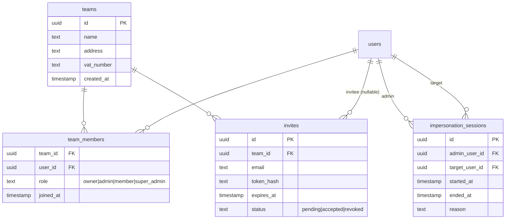

# Product Requirements Document – Team‑Auth Module for Nuxt 3 + Supabase

_Date_: 8 Jun 2025  *Author*: _your name here_

---

## 1 Purpose

Provide a **drop‑in Nuxt 3 module** that layers **single‑team, multi‑member authentication** on top of Supabase Auth. The module should rival Clerk/Auth0 for ease of use while remaining 100 % OSS and within the Supabase ecosystem.

---

## 2 Goals & Success Metrics

| Goal                      | Metric                                                          | Target   |
| ------------------------- | --------------------------------------------------------------- | -------- |
| Fast integration          | Time from `npx nuxi@latest add team-auth` to first team created | ≤ 30 min |
| Delightful invite flow    | Invite-flow NPS                                                 | ≥ 40     |
| Low support burden        | Auth tickets per 500 end‑users (30 days)                        | < 1      |
| Production‑ready security | External pen‑test high‑severity findings                        | 0        |

---

## 3 Users & Stakeholders

- **Founding Engineer** – needs team+RBAC yesterday, no bandwidth to build it.
- **Growth‑Stage Dev Team** – on Supabase; wants teams/roles w/o leaving stack.
- **End‑User Employee** – expects familiar "Team" panel and Slack‑style invites.
- **Product/CEO** – sees multi‑member teams as monetisation lever.

---

## 4 Personas & Key Use‑Cases

| Persona                    | Scenario                                    | Success Criteria                               |
| -------------------------- | ------------------------------------------- | ---------------------------------------------- |
| **Owner**                  | Signs up, names team, lands in dashboard    | Account+team created in one flow; role="owner" |
| **Admin**                  | Invited, accepts link, promotes a colleague | Invite link auto‑joins; can change roles       |
| **Member**                 | Signs in, updates profile pic               | No role‑mgmt access; profile persists          |
| **Super‑Admin (internal)** | Starts impersonation to debug a ticket      | Sees banner; audit log created; can exit       |

---

## 5 Assumptions & Constraints

1. **One team per user** (v1).
2. Supabase Auth already powers email/password & social login.
3. App uses **Nuxt 3** (`<script setup>`, Composition API).
4. Styling via **Tailwind CSS**; components expose slots/props for custom UI.
5. Email delivery via Supabase SMTP or custom transporter.
6. **UI primitives** should primarily use **Nuxt UI** (open‑source) components (e.g., `<UButton>`, `<UInput>`, `<UCard>`, `<UDropdown>`); use of **Nuxt UI Pro** components is **out of scope**.

---

## 6 Functional Requirements

| Ref      | Requirement                                                                                                                                                                                                                                                                                                                                                                                         |
| -------- | --------------------------------------------------------------------------------------------------------------------------------------------------------------------------------------------------------------------------------------------------------------------------------------------------------------------------------------------------------------------------------------------------- |
| **FR‑1** | User **must create a team** during sign‑up (team name required).                                                                                                                                                                                                                                                                                                                                    |
| **FR‑2** | Roles: `owner` (creator, one per team), `admin`, `member`, \`super_admin\`                                                                                                                                                                                                                                                                                                                          |
| **FR‑3** | **Invites**: owner/admin invite by email; tokens expire in 7 days; can resend/revoke.                                                                                                                                                                                                                                                                                                               |
| **FR‑4** | **Role management**: owner/admin can promote/demote; owner can transfer ownership or delete team (cascades).                                                                                                                                                                                                                                                                                        |
| **FR‑5** | **Profile management**: name, avatar, password, MFA toggle.                                                                                                                                                                                                                                                                                                                                         |
| **FR‑6** | **UI kit** (Vue 3 components): `<AuthSignIn>`, `<AuthSignUpWithTeam>`, `<UserButton>`, `<ProfileForm>`, `<TeamMembersTable>`, `<TeamSettingsModal>`, `<SignedIn>`, `<SignedOut>`. These components should compose native **Nuxt UI** primitives such as `<UButton>`, `<UInput>`, `<UAvatar>`, `<UCard>`, `<UFormGroup>`, `<UDropdown>`, `<UModal>`, and `<UTable>`; use of Nuxt UI Pro is excluded. |
| **FR‑7** | Docs & demo: one `nuxi` command scaffolds pages and route guards.                                                                                                                                                                                                                                                                                                                                   |
| **FR‑8** | **Impersonation**: super‑admins can act as any user for ≤ 30 min; banner displayed; full audit trail; MFA re‑prompt on start.                                                                                                                                                                                                                                                                       |
| **FR‑9** | **Team settings**: teams store and allow admins to update legal address and VAT number.                                                                                                                                                                                                                                                                                                             |

---

## 7 Non‑Functional & Security Requirements

| Category             | Requirement                                                                                                                                                                        |
| -------------------- | ---------------------------------------------------------------------------------------------------------------------------------------------------------------------------------- |
| Performance          | Added latency ≤ 150 ms P95 per auth action.                                                                                                                                        |
| Accessibility        | WCAG 2.1 AA; keyboard & screen‑reader friendly.                                                                                                                                    |
| Security             | Supabase RLS on all rows; invite tokens hashed; JWTs signed w/ custom claims; super‑admins require MFA.                                                                            |
| Audit & Compliance   | Table `impersonation_sessions` keeps 1‑year history; logs immutable.                                                                                                               |
| Internationalisation | Strings externalised; default EN; JSON overrides.                                                                                                                                  |
| Extensibility        | Hooks for email templates, UI slots, new roles (v2).                                                                                                                               |
| Auth robustness      | Library ships with a single, pre‑selected email‑retrieval + magic‑link strategy chosen during implementation for reliability; no configuration required from consuming developers. |

---

## 8 Data Model (Postgres / Supabase)



**Key RLS policies**

| Table                    | Policy                                                                                             |
| ------------------------ | -------------------------------------------------------------------------------------------------- |
| `team_members`           | Members can `select`; admins/owners can `insert`/`delete` within their team.                       |
| `teams`                  | Only owner can `update`; all members can `select` their team.                                      |
| `invites`                | Admins/owners can manage invites for their team; invitee can `select` own pending invite by token. |
| `impersonation_sessions` | Only service‑role key inserts/updates; select allowed to super‑admin for own sessions.             |

---

## 9 Backend Functions (Supabase Edge Functions)

| Name                      | Purpose                                                                                                       | Inputs                           |
| ------------------------- | ------------------------------------------------------------------------------------------------------------- | -------------------------------- |
| `create_team_and_owner()` | Tx: create team, add caller as owner, issue session w/ team claims.                                           | `{ email, password, team_name }` |
| `accept_invite()`         | Validate token, add user to team, mark invite accepted.                                                       | `{ invite_token }`               |
| `transfer_ownership()`    | Owner → new owner, demote old owner to admin.                                                                 | `{ new_owner_id }`               |
| `start_impersonation()`   | Verify caller super‑admin + MFA; mint 30‑min JWT for target with `act_as` claims; log session.                | `{ target_user_id, reason }`     |
| `stop_impersonation()`    | End session, revoke JWT, update `ended_at`.                                                                   | `{ session_id }`                 |
| `get_user_emails()`       | Security‑definer function returning id + email for super‑admins; used as fallback in email retrieval cascade. | `–`                              |
| `get_user_email_by_id()`  | Return single email for a given user id (super‑admin only).                                                   | `{ user_id }`                    |
| `admin_login()`           | Generate magic link and verify OTP immediately to restore super‑admin session.                                | `{ email }`                      |

---

### 9.1 Auth & Magic‑Link Implementation Notes

- **Email retrieval strategy** – During development, the library implementer evaluates the available mechanisms (Supabase Admin API, RPC `get_emails_direct`, SQL `get_user_email_by_id()`) and selects **one** proven‑reliable method. The published library ships _only_ that method; consuming apps need no choice or configuration.
- **Magic‑link impersonation flow** – generate magic link without sending email, immediately verify OTP, and patch missing sessions when `verifyOtp` is inconsistent .
- **Defensive token storage & auto‑login** – preserve original admin session across four tiers (server‑verified, client‑verified, storage restore, manual) .
- **Security‑definer SQL functions** guard email access while keeping least privilege .
- **Graceful degradation** – cascading fallbacks for auth errors, with user‑friendly messages and partial success handling .

## 10 Frontend API (Nuxt composable `useTeamAuth()`)

```ts
const {
  currentUser,
  currentTeam,
  currentRole,
  signUpWithTeam,
  signIn,
  signOut,
  inviteMember,
  revokeInvite,
  resendInvite,
  promote,
  demote,
  transferOwnership,
  updateProfile,
  renameTeam,
  deleteTeam,
  // Impersonation
  startImpersonation,
  stopImpersonation,
  isImpersonating,
  impersonationExpiresAt,
} = useTeamAuth();
```

---

## 11 Implementation Blueprint for Impersonation

### 11.1 Pattern A – Short‑Lived JWT (Chosen)

1. `start_impersonation` edge fn (service‑role) issues 30‑min session for target with `act_as` claims.
2. Nuxt stores session; page reload → RLS now evaluates as target user.
3. Impersonation banner component reads claims and shows countdown.
4. `stop_impersonation` ends session or it auto‑expires; app reloads to admin context.
5. All actions logged in `impersonation_sessions`.

### 11.2 Security Notes

- Super‑admins must have MFA; edge fn re‑prompts for password/MFA.
- No privilege blending: admin routes blocked when `act_as = true`.

---

## 12 User Flows

1. **Sign‑Up & Team Creation** → `create_team_and_owner` → dashboard.
2. **Invite & Join** → email magic link → `accept_invite`.
3. **Role Management** → promote/demote via composable.
4. **Impersonation** → super‑admin opens user search → start → banner shows; stop → back to admin.

---

## 13 Release Plan

| Phase | Scope                                                  | Version |
| ----- | ------------------------------------------------------ | ------- |
| Alpha | Sign‑in/out, sign‑up w/ team, RLS + composable         | 0.1.0   |
| Beta  | Invitations, role mgmt, Tailwind UI, impersonation     | 0.5.0   |
| GA    | MFA toggle, i18n, a11y audit, CLI scaffold, full tests | 1.0.0   |

---

## 14 Open Questions / Risks

1. Multi‑team per user in future – data model ready, but claims & UI change.
2. Social‑auth collisions with pending invites – need safe merge path.
3. Email deliverability – provide custom SMTP option.
4. Privilege escalation – rigorous JWT claim validation & RLS testing.

---

## 15 Acceptance Criteria

1. Demo project passes CI, Lighthouse a11y ≥ 90.
2. Zero high‑severity vulns post pen‑test.
3. 95 % of integrators create first invite in ≤ 30 min.
4. Jest & Cypress coverage ≥ 90 %.
5. Impersonation sessions always log start & end, max 30 min.

---

## 16 Appendix – API Error Codes

| Code                         | Meaning                                 |
| ---------------------------- | --------------------------------------- |
| `TEAM_EXISTS`                | Team name already in use during sign‑up |
| `INVITE_EXPIRED`             | Invite token expired                    |
| `ROLE_FORBIDDEN`             | Caller lacks role permission            |
| `IMPERSONATION_UNAUTHORIZED` | Caller not super‑admin or lacks MFA     |
| `IMPERSONATION_EXPIRED`      | Act‑as JWT exceeded 30 min              |

---

## 17 Appendix – Nuxt UI Component Mapping

| Module Component                        | Nuxt UI Primitive(s)                                                                                                                             |
| --------------------------------------- | ------------------------------------------------------------------------------------------------------------------------------------------------ |
| `<AuthSignIn>` / `<AuthSignUpWithTeam>` | `<UCard>`, `<UFormGroup>`, `<UInput>`, `<UButton>`                                                                                               |
| `<UserButton>`                          | `<UAvatar>`, `<UDropdown>`                                                                                                                       |
| `<ProfileForm>`                         | `<UCard>`, `<UFormGroup>`, `<UInput>`, `<UButton>`                                                                                               |
| `<TeamMembersTable>`                    | `<UTable>`, `<UBadge>`                                                                                                                           |
| `<TeamSettingsModal>`                   | `<UModal>`, `<UFormGroup>`, `<UInput>`, `<UButton>`                                                                                              |
| `<SignedIn>` / `<SignedOut>`            | Thin wrappers that conditionally render their slot using `v-if` and `isSignedIn` from `useTeamAuth()`; no dedicated Nuxt UI primitives required. |

## 18 Packaging & Distribution

**Installation flow**

```bash
npm install @yourco/team-auth          # adds module code + CLI
npx team-auth init                     # copies migrations + edge functions, then runs supabase db push
```

Steps performed by `team-auth init`:

1. Creates `supabase/migrations/team-auth/` and copies versioned `.sql` files.
2. Copies edge‑function source (TypeScript) into `supabase/functions/team-auth/`.
3. Detects if the project is already linked to Supabase; if so, auto‑runs `supabase db push` (local) or `supabase db remote commit`.
4. Adds a `team-auth` entry to `package.json` scripts:

   ```json
   "scripts": {
     "team-auth:migrate": "team-auth migrate"
   }
   ```

5. Prints reminder to commit the copied files so CI/CD (or Supabase Cloud Deploy) applies them automatically.

**Upgrade flow**

```bash
npm install @yourco/team-auth@latest
npx team-auth migrate                  # applies only new migrations in order
```

The CLI verifies:

- Database schema version ≤ package version (prevents drift).
- Supabase CLI installed and project linked.

**Versioning policy**

- **Patch** (`x.y.+1`) → no schema change.
- **Minor** (`x.+1.0`) → backward‑compatible migrations added.
- **Major** (`+1.0.0`) → breaking schema change; release notes include manual migration steps.

_End of Document_
